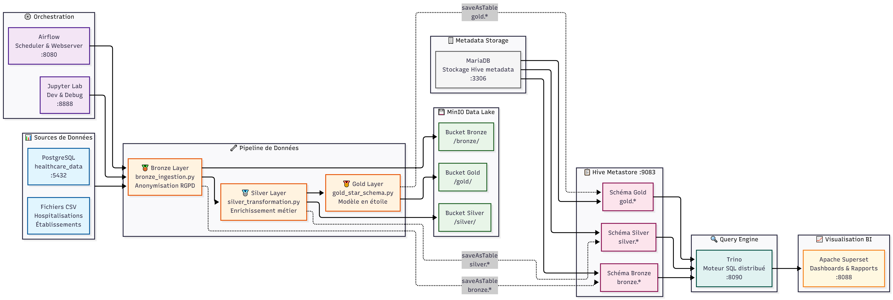
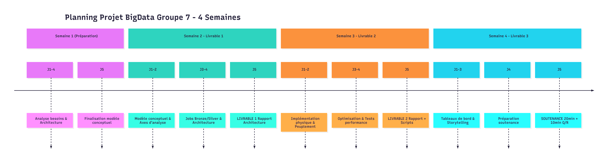
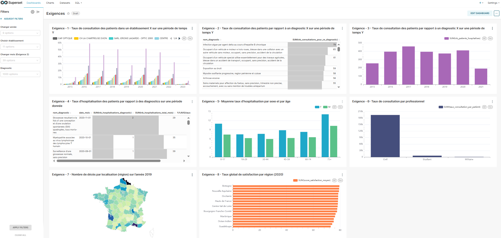
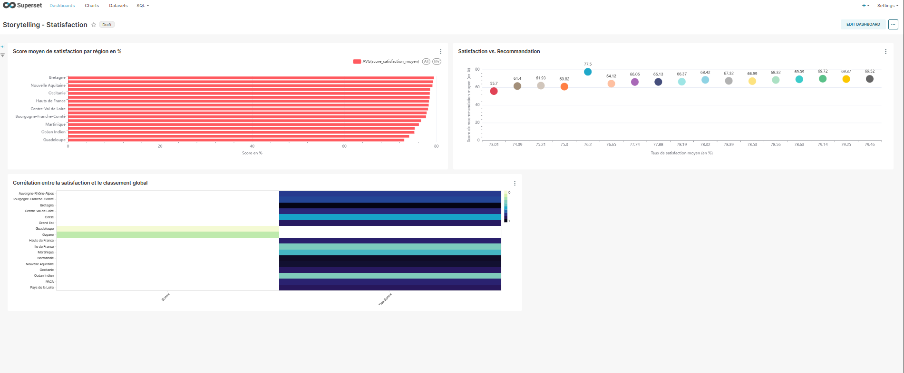
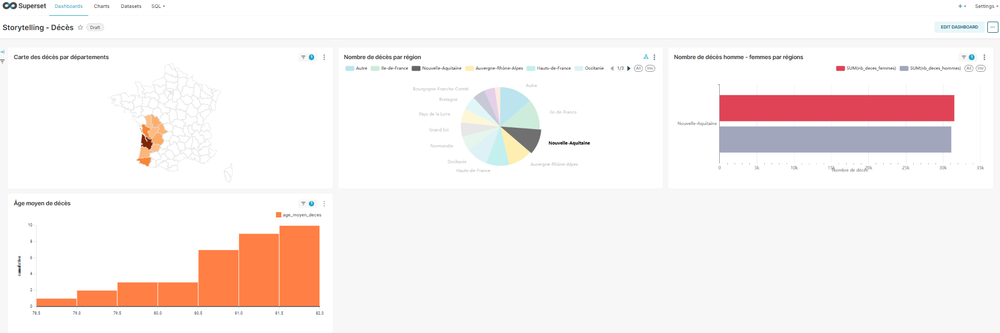

Lire ce document dans d'autres langues: [English](README.md)

# Plateforme de Données Big Data pour le Groupe CHU

     

### Contexte du Projet

Le secteur de la santé fait face à une transformation digitale rapide, où l'exploitation des données médicales est devenue une nécessité pour améliorer la qualité des soins et les performances des établissements. Le groupe CHU (Cloud Healthcare Unit) a initié ce projet pour construire son propre entrepôt de données afin d'exploiter la quantité considérable d'informations générées par ses systèmes.

L'objectif est de surmonter les défis du Big Data (volume, variété, vélocité) en créant une architecture évolutive, sécurisée et performante pour intégrer, stocker et analyser des données hétérogènes (dossiers médicaux, affluence des patients, suivi des services, etc.).

### Objectifs

Le projet vise à fournir une solution complète pour :

1.  **Intégrer des données** provenant de sources distribuées (BDD PostgreSQL, fichiers CSV/FTP) dans une source unique et persistante.
2.  **Modéliser et stocker** ces données dans un entrepôt de données (Data Warehouse) pour répondre aux besoins analytiques.
3.  **Analyser et visualiser** les données pour répondre à des questions métier précises.
4.  **Proposer une architecture** et un outillage modernes (ETL, stockage, BI) garantissant sécurité, scalabilité et coût-efficacité.

### Architecture de la Solution

La plateforme met en œuvre une architecture de Data Lakehouse moderne, orchestrée par Docker Compose. Les données suivent un parcours ETL (Extract, Transform, Load) à travers trois couches logiques dans le Data Lake (MinIO) :

-   **Couche Bronze** : Les données brutes sont ingérées depuis les sources (PostgreSQL, CSV) et stockées en format Parquet, sans transformation majeure. C'est une copie fidèle et horodatée de la source.
-   **Couche Silver** : Les données de la couche Bronze sont nettoyées, normalisées, dédoublonnées et enrichies. Les règles de gestion et de qualité des données sont appliquées à ce niveau.
-   **Couche Gold** : Les données de la couche Silver sont agrégées et modélisées en un schéma en étoile, optimisé pour les requêtes analytiques. Ces tables (faits et dimensions) alimentent directement les tableaux de bord.

### Pile Technologique

-   **Orchestration de pipeline** : Apache Airflow
-   **Traitement des données** : Apache Spark (PySpark)
-   **Stockage Data Lake** : MinIO
-   **Entrepôt de données (Metastore)** : Apache Hive Metastore
-   **Moteur de requête SQL distribué** : Trino
-   **Visualisation (Business Intelligence)** : Apache Superset
-   **Conteneurisation** : Docker & Docker Compose

### Accès aux Services

Une fois la plateforme démarrée via `docker-compose up -d`, les différentes interfaces sont accessibles via votre navigateur :

-   **Interface Airflow** : `http://localhost:8080`
    -   **Login**: `admin` / `admin123`
-   **Jupyter Lab** : `http://localhost:8888`
    -   **Token**: `admin123`
-   **Console MinIO** : `http://localhost:9001`
    -   **Login**: `minioadmin` / `minioadmin123` (ou selon votre `.env`)
-   **Interface Superset** : `http://localhost:8088`
    -   **Login**: `admin` / `admin123`
-   **Interface Trino** : `http://localhost:8090`

### Pipeline de Données (DAG Airflow)

Le pipeline principal est défini dans `airflow/dags/chu_docker_pipeline.py`.

-   **`chu_docker_pipeline`** : Ce DAG orchestre l'exécution des scripts Spark pour les couches Bronze, Silver et Gold.
    -   Il utilise le `DockerOperator` d'Airflow pour lancer chaque job Spark dans un conteneur Docker isolé, garantissant la reproductibilité et l'isolation des dépendances.
    -   Les tâches s'exécutent de manière séquentielle : `bronze` -> `silver` -> `gold`.
    -   Le DAG est configuré pour s'exécuter chaque jour à 2h du matin, mais peut être déclenché manuellement depuis l'interface d'Airflow pour des exécutions à la demande.

### Captures

#### Architecture

#### Planning

#### Dashboards Superset

